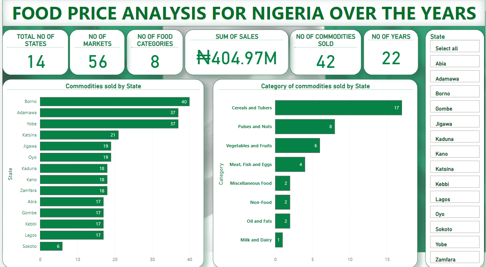
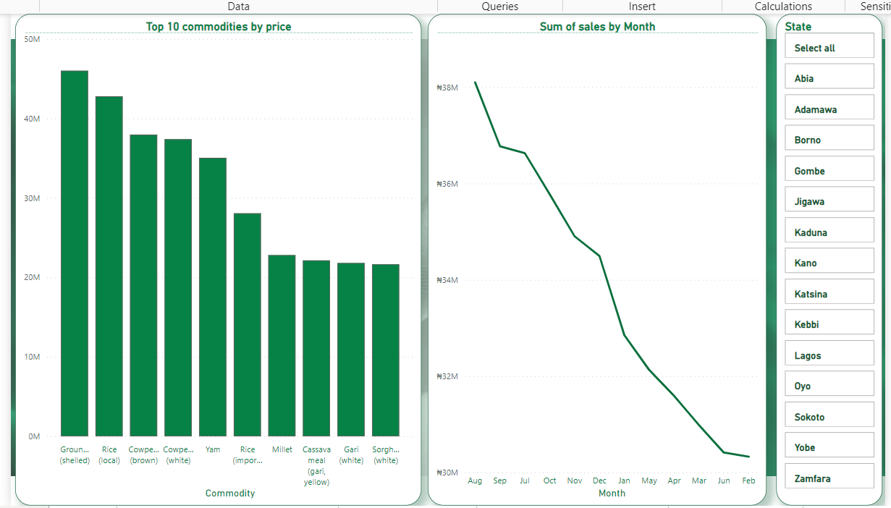
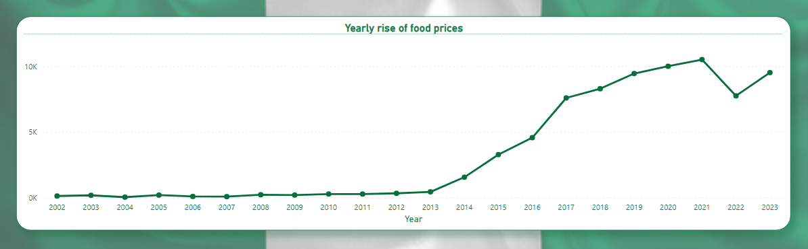
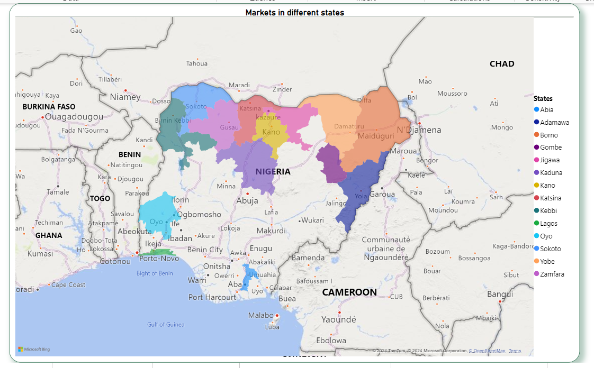

# FOOD PRICE ANALYSIS FOR NIGERIA
This is an analysis of food prices data from 2002-2023 in Nigeria sourced from the World Food Programme Price Database.
The analysis covers staple foods such as maize, rice, beans, palm oil and fuel across selected states in Nigeria.  

**DOCUMENTATION OUTLINE**
- [Project overview](#project-overview)
- [Data sources](#data-sources)
- [Tools for analysis](#tools-for-analysis)
- [Data cleaning](#data-cleaning)
- [Results and findings](#results-and-findings)
- [Limitations of the analysis](#limitations-of-the-study)
- [Recommendations](#recommendations)

## Project Overview

This study analyzes food prices for Nigeria from 2002 - 2003 across selected states in Nigeria. By conducting a price analysis, policymakers, businesses, and consumers can gain insights into the trends and fluctuations in food prices, allowing them to make informed decisions. This analysis can help identify potential food security issues, assess the impact of external factors like weather events or economic conditions, and develop strategies to mitigate price volatility. Additionally, a food price analysis can also help in identifying opportunities for cost savings, market expansion, and sustainable sourcing practices, ultimately contributing to a more efficient and resilient food system.

## Data sources

The data used is a collation of a series of data by the [World Food Program](https://www.wfp.org/) and it is updated every month

To get a direct link, [click here](https://data.humdata.org/dataset/wfp-food-prices-for-nigeria). Note that the downloaded series for the month of March was used for this analysis

## Tools for analysis

Power BI [You can find it here](https://powerbi.microsoft.com/en-us/downloads/)

## Data cleaning

The data was checked for blanks and duplicates, unnecessary row deleted, renamed each column and formatted to the correct data type. 

I removed outliers from the data by checking for prices of goods whose figures are not reasonable. 

## Results and findings

### Insights from the analysis

#### Major KPIs at a glance

- Data on food prices was collated from 2002-2023 and covers 14 states in Nigeria and 56 markets in these states were analyzed. 8 food categories were identified and 42 commodities were sold during this period.  Borno, Adamawa and Yobe are top 3 states in terms of commodities sold. The total recorded sales amount to ₦404.97 million.
  
- Cereals and tubers, pulses and nuts and vegetables and fruits were the leading categories, with 17 commodities such as rice, millet, yam, cassava etc. categorized under cearels and tubers. Other non food items such as diesel and petrol (gasoline) was also analyzed
 

### Top 10 commodities by price and highest sales by month

The top 10 commodities sold are 

- Groundnut (shelled), 
- Rice (imported), 
- Cowpea (brown), 
- Yam (white), 
- Dry Maize, 
- Millet,
- Cassava meal (gari, yellow), 
- Gari (white), 
- Sorghum (red), and 
- Sorghum (white).

On the right side, the line graph titled Sum of sales by Month depicts a declining trend in sales from August to February. August reported the highest sales of commodities  due to the fact that harvesting is usually done at this time and there are more goods available for sale in the market while the month of February saw the least amount of sales due to the dry season when planting does not occur.

### Yearly rise of food prices

The graph above shows a steady increase in food prices over the years. Minimal increase is observed from 2002 to around 2013. After 2013, there's a significant upward increase in food prices. The highest point is reached in 2021, followed by a slight decline in 2022 and an upward surge in 2023

The drop in food prices in 2022 could be attributed to the growth rate in the agricultural sector from the last quarter of 2021 to the first quarter in 2022
(Source:[Statista.com](https://www.statista.com/statistics/1193510/agricultural-sector-growth-in-nigeria/#:~:text=In%20the%20second%20quarter%20of,growth%20of%20over%203.5%20percent))

### Map showing areas covered by the study 

This map shows the markets across different states in Nigeria and its neighboring countries. 

Each state within Nigeria is color-coded, making it easy to identify various market regions.

## Limitations of the study

1. The data didn't cover all the geopolitical zones in Nigeria. Not a single State from the North Central and South South geo-political zones was representated. 

2. Also, data was not evenly collected across all the same number of markets in some states. Borno and Yobe states had the highest number of markets where food prices were collated while some states had just one market each.

3. Using the Consumer Price Index (CPI) to calculate inflation would present some limitations. The CPI measures the percentage change in the prices of a basket of goods and services of household goods. These goods and services are divided into eight categories: housing, apparel, transportation, medical, recreation, food and beverages, education, and other goods and services. This study only analyzed foods and non-food items excluding other categories which are important for measuring inflation rate. 

## Recommendations

- Despite the reported high rate of insecurity in the North East, Borno and Yobe states had the highest number of markets were where the data was collected. This could be as a result of the amount of grains produced in these states. The administration can protect farmers and ensure food security by providing infrastructure to secure farmlands and agricultural produce.

- Stakeholders in agriculture can invest in improving food distribution networks, storage facilities, and transportation infrastructure to reduce food losses, ensure food reaches markets efficiently, and stabilize prices from the North to other states in the South.

- Areas where food production is lower compared to the North, the adoption of sustainable farming methods such as agroecology, organic farming, and conservation agriculture to protect the environment and ensure long-term food security should be encouraged.

